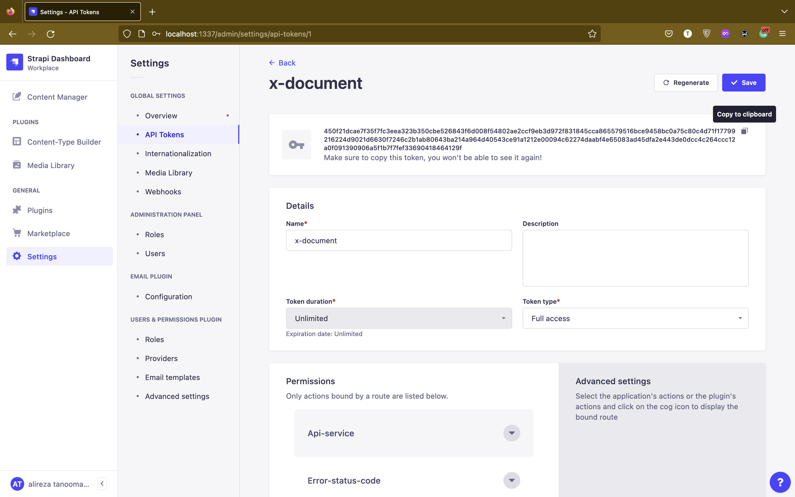

# X OpenAPI Document
This project created to make documentation automate as possible, in addition to improving developers experience who will work with these services.

The project heavily relies on [OpenAPI schema standard](https://spec.openapis.org/oas/latest.html) which will fetch through each service endpoint, e.g. `https://service1.example.com/swagger.json` and `https://service2.example.com/swagger.json`. After gathering all target **OpenAPI** files, the project merge all of them into single `json` content, then replace `info` object, `servers`, `description`(s), `operationId`(s), etc. with the contents from admin panel and add some extra information and content like __Postman Collection__ and __Sample Code__ for each service to the final file. Finally display a pretty and developer friendly document (^_^).

## Table of content
- [X OpenAPI Document](#x-openapi-document)
  - [Table of content](#table-of-content)
  - [Technologies in use](#technologies-in-use)
  - [Setup and Run](#setup-and-run)
    - [Requirement](#requirement)
    - [Steps](#steps)
  - [Edit `api service`](#edit-api-service)
  - [Edit `error status code`](#edit-error-status-code)
  - [Edit `info`](#edit-info)
  - [Add new source](#add-new-source)
  - [Add new security schemes](#add-new-security-schemes)
  - [Last Note](#last-note)
- [Happy Coding!](#happy-coding)


## Technologies in use
- Docker (v20.10.x)
- Docker Compose (v2.12)
- Nodejs (v16 or newer)
- Strapi (v4)
- Nextjs (v13)


## Setup and Run
### Requirement
- Docker (v20.10.x or newer)
- Docker Compose (v2.12 or newer)
- Nodejs (v16.x or newer)
### Steps
1. Run `bash setup.sh`.
2. Fill the fields in `.env` file.
3. In the root of project run `docker-compose up -d`.
4. Go to `document-cms` folder and fill the fields in `.env` file.
5. Run `npm run develop` to run admin panel.
6. Open [Admin Panel](http://localhost:1337/admin/auth/register-admin) in your browser.

7. Fill the form and continue to the panel.
8. Go to `Content Manager` and click on **Introduction**.

1.  Change the fields if you want and then click on **Save** button and the **Publish** button to publish the content.
2.   Go to **Setting** and create an **API Token** with `full-access` and `unlimited` expire time.

1.  Copy generated token and fill it in `.env` file for `ADMIN_PANEL_TOKEN` in the root of project. Important! don't forget to save token in panel.


1.  In the root of project, run command below to reload environment variables
```bash
docker-compose down && docker-compose up -d
```
1.  Open `http://localhost:2233` in your browser to visit document ([link](http://localhost:2233)). If you did steps correctly, you should see your introduction content on document page and additional content like **Sample Codes** and link to **Postman Collection** which generated from merged OpenAPI file.
    


## Edit `api service`
For editing service content, go to **Content Manager>Collection Types>Api Service**. Then select the service you want to edit.
<br/>

<br>
You can change `title`, `description`, `response_description`, `public` (service visibility), and `service_input` and `service_output` which sets description for service fields.

| Field | Description | Read Only | Default |
| :----- | :----------- | :---------: | :------- |
| identifier | Service **ID** | Yes | `SERVICE_METHOD:SERVICE_URL` |
| title |  Service title for naming service in document. This field will shown in document menu | No | `OperationId` |
| description | Any additional description that can use as service description, use cases, etc. | No | -- |
| response_description | For display any additional information for service response | No | -- |
| public | service visibility status. If you turn this field false, api service will remove from document. Useful for case that there is some business reason for some services to not be visible for everyone | No | True |
| service_input | service request description. **request body** exist in `body` field, **request paths parameters** exist in `paths`, **request header parameter** exist in `headers` field and **request query parameters** exist in `queries`. **IMPORTANT!!**, JUST ONLY change the value of description fields; otherwise your content will not appears in document | No But Yes (😊) | JSON |
| service_output | service response description. Each response content-type has its declaration and if a content-type has multiple response schema, you have an array of response schemas, **IMPORTANT!!**, JUST ONLY change the value of description fields; otherwise your content will not appears in document | No But Yes (😊) | JSON |

## Edit `error status code`
As system error codes description should remain same in every systems. So description of system error can be sets in one place. 
<br>
For editing description of error status codes, go to **Content Manager>Collection Types>Error Status Code**, then select error status code and edit description.
<br/>

<br>

## Edit `info`
You do it in [Setup and Run](#setup-and-run) in step 8. You can figure it out 😉.

## Add new source
Go to `./x-openapi-documentation/config` and change `openapiSourceList`. Each source should have unique prefix.
```js
export const openapiSourceList: OpenApiSource[] = [
  ...
  {
    url: 'http://api.example.com/assets/swagger.json',
    prefix: '/example-unique-prefix',
  },
  ...
];
```

## Add new security schemes
Go to `./x-openapi-documentation/config` and change `openapiSecuritySchemes`. Each source should have unique prefix.
```js
/**
 * [more info for redocly and securitySchemes](https://redocly.com/docs/openapi-visual-reference/security-schemes/)
 * [for OAuth2 see this link](https://redocly.com/docs/openapi-visual-reference/oauth-flows/)
 */
export const openapiSecuritySchemes: {
  [key: string]: {
    type: 'apiKey' | 'http' | 'oauth2' | 'openIdConnect';
    name: string;
    in: 'query' | 'header' | 'cookie';
    scheme?: any;
  };
} = {
  api_key: {
    type: 'apiKey',
    name: 'authorization',
    in: 'header',
  },
  Authorization: {
    type: 'http',
    name: 'authorization',
    in: 'header',
    scheme: 'basic',
  },
};
```

## Last Note
- **API Service** and **Error Status Code** records will insert automatically. So, there is no need to create new entry for new services. They JUST need to be exist in their project OpenAPI file.
- If you already got strapi admin panel, just copy folders in `./document-cms/src/api` in your strapi project and build your project again.
- For adding this features to existing **nextjs** project, you just need to copy files as below and add them to your project: 
```
|- ./x-openapi-documentation
    |- config
       |- openapi.ts
      
    |- pages
       |- api
          |- openapi
             |- index.ts
             |- postman.ts

    |- public
       |- docs-logo.jpeg

    |- server
       |- admin-panel.service.ts
       |- openapi-extensions.service.ts
       |- openapi.service.ts

    |- types
       |- index.ts
    
    |- utils
       |- index.ts
    
```


# Happy Coding!
This project created by effort of finnotech developers. To the moon 🚀